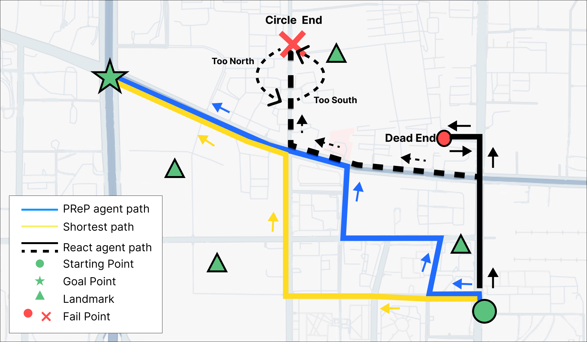
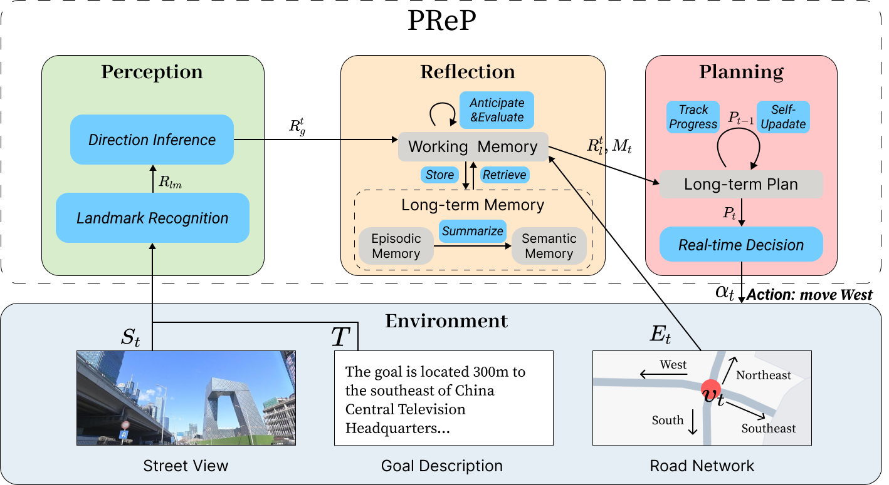
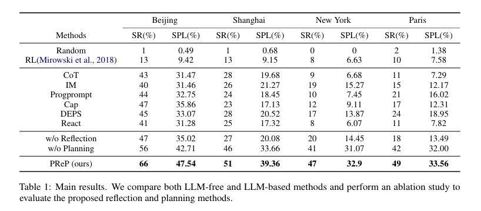
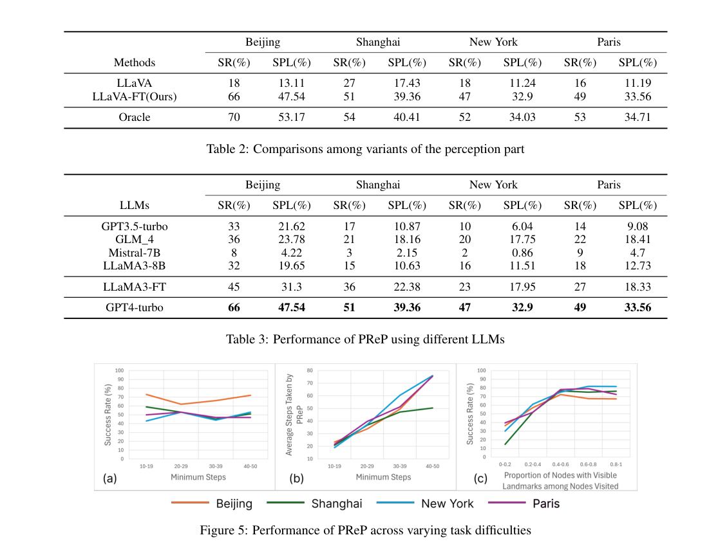

## Perceive, Reflect, and Plan: Goal-Directed City Navigation Elicits Spatial Intelligence in LLM Agents

To help you reproduce the experiment results,  the code and dataset are available in this repository. 

```
git clone https://anonymous.4open.science/r/PReP-13B5.git
cd PReP
pip install -r requirements.txt
```

To enable you to start the experiment faster, we save the LLaVA responses involved in the experiment (both before and after fine-tuning) as local files to be called directly, see <dataset/llava_response_local/>.

In <modules/LLM.py>, you should add your api_key;
```
openai_api_key = "sk-xxxxx"     # if you use openai GPT API
others_api_key = "xxxxxxxx"     # if you use other LLM API
```

You can run main.py to reproduce the experiments easily by selecting different parameters.

The metrics would be saved to Fold metric_files, and the LLM request-repsonse data would be saved to Fold log_data. 

---


**Abstract**  Spatial intelligence is a key aspect of human cognition and also crucial for AI agents. Although recent advances in LLM agents demonstrating strong general reasoning abilities, they still struggle with spatial intelligence, largely due to a lack of high-quality training data. To address this challenge, we propose a novel goal-directed city navigation task that requires agents to navigate complex urban environments using visual street view perception and textual goal descriptions, encompassing spatial perception, representation, and reasoning abilities. We construct a realistic open-city navigation environment using street views and road networks from four cities. Experiments show that this task is challenging even for powerful models like GPT-4, with success rates of only 11\% in Paris and 8\% in New York. We design an agentic workflow, PReP (Perceive, Reflect, Plan), which significantly improves success rates into average 54\%. Through the PReP workflow and environmental feedback, we efficiently generated 30k high-quality data for complex city navigation. Fine-tuned LLMs with these data results in a notable increase in navigation success rates, with 13\% improvement observed. Furthermore, generalization experiments on classic spatial cognition benchmarks show that this strategy effectively enhances the general spatial abilities of LLM agents. Our study introduces a research direction that enables LLMs to develop spatial cognitive skills in real-world complex city environments. 



This paper proposes an effective agentic workflow that improves the spatial cognitive ability of LLMs thus improving the goal-directed city navigation performance. We fine-tune LLaVA and find it can perceive the direction and distance of landmarks with sufficient accuracy for navigation.  Inspired by the theory of human cognition, we propose a memory scheme to help the agent form the cognitive map. The historical trajectories and observations are stored and summarized to learn an intrinsic spatial representation of the environment, *i.e.*, an internal city map. The agent combines the historical experience and current observation to evaluate current situation and infer the goal direction. To improve over short-sighted actions, we resort to long-term planning. Specifically, considering the reflections and current road network connection, the agent decompose the full path into several sub-goals, ensuring consistent and reasonable movement to the final goal during long-range navigation. These components form the '*Perceive*, *Reflect*, and *Plan*' workflow which allows the agent to perform long-range city navigation.



We construct a realistic urban navigation environment for this problem from four major cities: Beijing, Shanghai, New York, and Paris. The datasets contain complex road networks with thousands of road nodes and street view images, presenting significant challenges for AI agents. Our experiments show that even for powerful models like GPT-4, the success rates are only 11\% in Paris and 8\% in New York, underscoring the difficulty of real-world city navigation. To address this challenge, we propose a novel agentic workflow, named PReP (Perceive, Reflect, Plan),  which significantly enhances the spatial intelligence of LLMs for city navigation. For spatial perception, we fine-tune LLaVA and find it can perceive the direction and distance of landmarks with sufficient accuracy for navigation. Inspired by the theory of human cognition, we propose a memory scheme to help the agent form the cognitive map. The historical trajectories and observations are stored and summarized to learn an intrinsic spatial representation of the environment, an internal city map. Finally, to improve the spatial reasoning ability and overcome short-sighted actions, we resort to long-term planning. Specifically, considering the reflections and current road network connection, the agent decomposes the full path into several sub-goals, ensuring consistent and reasonable movement to the final goal during long-range navigation. These components form the `Perceive, Reflect, and Plan' workflow that enhances the agent's spatial intelligence and makes it easily perform long-range city navigation.


Experiments in the four city datasets show that the proposed workflow significantly outperforms methods that could be applied to our task, achieving a success rate of 54\% on the average of the four city test sets. We find the perception component produces accurate spatial relations to support city navigation, the success rate of which is only 5\% lower than navigation with ground truth perception results. Besides, we show that reflection and planning can help the LLM agent to form the cognitive map and further contribute to the success rate and make it useful when dealing with long-range navigation tasks. By leveraging the PReP workflow and environmental feedback, we generate a dataset containing 30k high-quality nvigation data with complex spatial reasoning components. We use these data to fine-tune LLMs, significantly enhancing their navigation success rates. For example, fine-tuning LLaMA3 with our dataset results in a nearly 13\% increase in success rate compared to the base LLaMA3 model. Beyond city navigation, we also evaluate the fine-tuned LLMs on two spatial intelligence benchmarks, stepgame and CogEval, showing marked improvement in spatial reasoning capabilities. These results indicate that the proposed workflow can automatically annotate data to fine-tune and bolster spatial intelligence in LLMs, presenting a scalable and efficient method to enhance spatial intelligence for practical applications.

To summarize, our contributions are as follows:
- We introduce a goal-directed city navigation task and construct corresponding environments and datasets to evaluate and test the spatial intelligence of LLM agents.
- We propose the PReP (Perceive, Reflect, Plan) agentic workflow, which significantly improves LLM performance in goal-directed city navigation tasks.
- We demonstrate that the PReP workflow can be used to automatically annotate data to fine-tune and enhance spatial reasoning in LLMs, offering a scalable, efficient way to improve spatial intelligence for real-world tasks.





